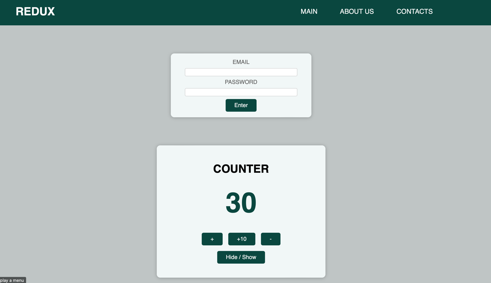

# Educational project to learn React

Project is created to practice Redux.

## To run the application

run the next command from the root of project:

### `npm install`

and then

### `npm start`

Open [http://localhost:3000](http://localhost:3000) to view it in your browser.

